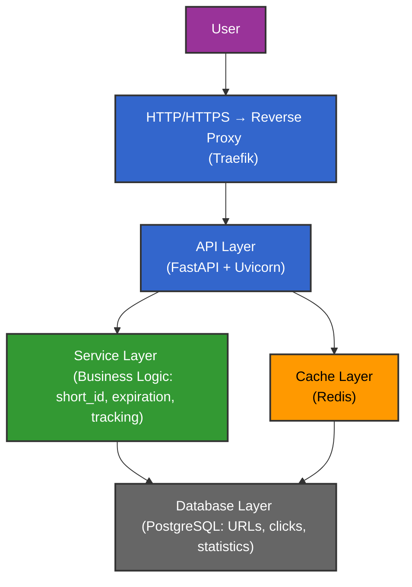

# Py URL Shortener

## Project Overview

**Py URL Shortener** is a Python-based backend project that allows users to shorten URLs, track clicks, set expiration dates, and monitor usage statistics. The application demonstrates a professional, layered architecture with scalability, containerization, and real-world backend best practices.

**Core Features:**
- Shorten long URLs and generate a unique short identifier
- Redirect users to the original URL
- URL expiration mechanism
- Click tracking (count, IP, timestamp, and user-agent)
- Modular architecture suitable for future expansion
- Containerized deployment using Docker and a reverse proxy

---

## Architecture

The project uses a **Layered Architecture** with a light microservices approach:

- **API Layer (FastAPI)**: Exposes endpoints and handles requests and validations.
- **Service Layer**: Implements business logic such as short_id generation, expiration, and click tracking.
- **Database Layer (PostgreSQL)**: Stores URLs, clicks, and analytics.
- **Proxy Layer (Traefik)**: Routes requests, manages HTTPS, and load balancing.
- **Cache Layer (optional - Redis)**: Speeds up access to popular URLs and statistics.

**Advantages:**
- Decoupled layers allow easier testing and maintenance
- Scalable and modular for future microservices
- Professional deployment setup with containerization and reverse proxy

---

## Architecture Diagram

