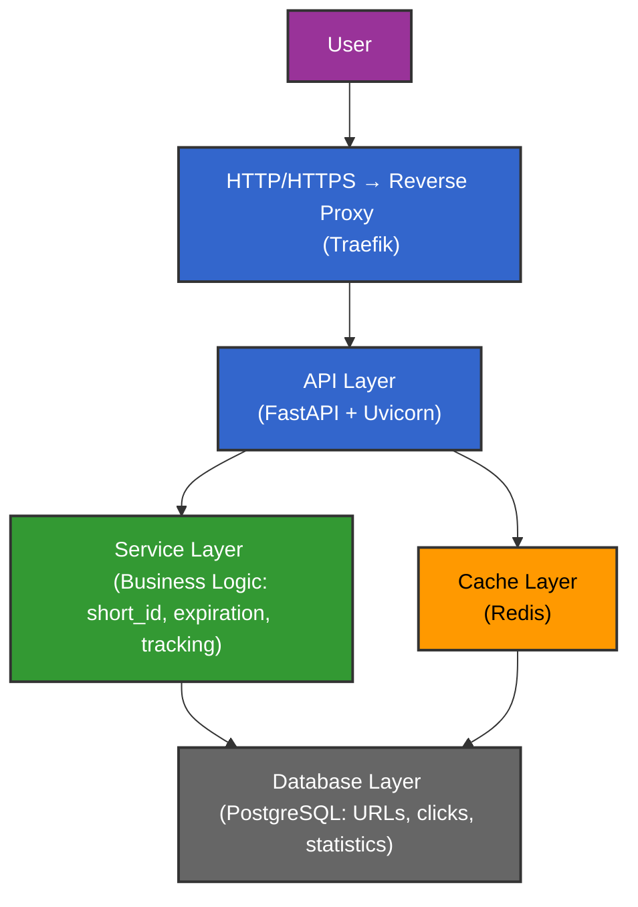

<div align="center">
    
</div>
<div align="center">
    <a href="https://www.python.org/" target="_blank">
        
    </a>
    <a href="https://fastapi.tiangolo.com/" target="_blank">
        
    </a>
    <a href="https://www.postgresql.org/" target="_blank">
        
    </a>
    <a href="https://www.docker.com/" target="_blank">
        
    </a>
    <a href="https://redis.io/" target="_blank">
        
    </a>
    <a href="https://traefik.io/" target="_blank">
        
    </a>
    </h1>
</div>
<br>


## Project Overview

**Py URL Shortener API** is a lightweight, high-performance backend service designed to:

- Shorten long URLs into compact, shareable links.
- Redirect users to the original URL with proper HTTP status handling.
- Track clicks and metadata such as IP, user agent, and referer.
- Optionally expire URLs after a set period.

This application is built with **FastAPI**, uses **PostgreSQL** for persistent storage, and leverages **Redis** (ready for caching, analytics, or rate-limiting). **Docker Compose** orchestrates the services, and **Traefik** handles routing and reverse proxy.

---

## Core Features:
- Shorten long URLs and generate a unique short identifier
- Redirect users to the original URL
- URL expiration mechanism
- Click tracking (count, IP, timestamp, and user-agent)
- Modular architecture suitable for future expansion
- Containerized deployment using Docker and a reverse proxy

---

## Architecture

The project uses a **Layered Architecture** with a light microservices approach:

- **FastAPI**: Handles asynchronous HTTP requests, endpoints, and business logic.
- **PostgreSQL**: Stores URLs and click metadata persistently.
- **Redis**: Optional caching or analytics (ready for future enhancements).
- **Traefik**: Reverse proxy for routing HTTP requests, provides a dashboard for monitoring.

All components are containerized using **Docker**, orchestrated with **Docker Compose**, ensuring easy deployment and reproducibility.


**Advantages:**
- Decoupled layers allow easier testing and maintenance
- Scalable and modular for future microservices
- Professional deployment setup with containerization and reverse proxy

---

## Architecture Diagram

---

## API Endpoints
### 1. Shorten URL

**Path**: /api/v1/shorten
**Method**: POST
**Request Body - example**:
```
{
  "url": "https://google.com/",
  "expires_in": 3600
}
```
**Response - example**:
```
{
  "short_url": "http://localhost/r/HrTBms",
  "code": "HrTBms",
  "expires_at": "2025-10-21T16:26:30.000Z"
}
```

### 2. Redirect to Original URL

**Path**: /r/{code}
**Method**: GET
**Request - example**:
```
/r/HrTBms
```
**Response - example**:
```
Redirects to the original URL.
In this case: https://google.com
```


### 3. Retrieve Link Statistics  

**Path**: /api/v1/stats/{code}  
**Method**: GET  

#### **Purpose**

This endpoint provides **detailed statistics** for a shortened URL.  
It allows you to monitor link performance and user engagement by retrieving:  
- Total number of clicks  
- Creation and expiration timestamps  
- The time of the most recent access  
- A list of all individual click events with their timestamps  

This feature is foundational for building an **analytics dashboard** — enabling insight into traffic behavior, popular links, and user interaction over time.


#### **How It Works**

When a user accesses a shortened URL (via `/r/{code}`), each visit is logged in the database with:
- The `URL ID` (from the main URL table)
- The `Click ID`
- The `occurred_at` timestamp
- The `IP`, `Referer`, and `User-Agent`  

The `/api/v1/stats/{code}` endpoint then:
1. Looks up the original URL using its **unique code**.  
2. Counts total clicks (`func.count(Click.id)`).  
3. Finds the last click timestamp (`func.max(Click.occurred_at)`).  
4. Lists every click event (click ID + time).  
5. Returns a structured JSON object with these statistics.


#### **Response Example**

**Request:**
```GET /api/v1/stats/HrTBms```

**Response:**
```json
{
  "code": "HrTBms",
  "original_url": "https://google.com/",
  "created_at": "2025-10-21T15:26:30.000Z",
  "expires_at": "2025-10-22T15:26:30.000Z",
  "total_clicks": 3,
  "last_click_at": "2025-10-23T10:00:00.000Z",
  "clicks": [
    { "click_id": 1, "time": "2025-10-22T10:00:00.000Z" },
    { "click_id": 2, "time": "2025-10-22T11:00:00.000Z" },
    { "click_id": 3, "time": "2025-10-23T10:00:00.000Z" }
  ]
}
```

**Implementation Highlights** 

- Aggregates statistics using func.count() and func.max() for performance.

- Returns ISO 8601 timestamps for consistency and API interoperability.

- Designed to integrate seamlessly with upcoming front-end dashboards or analytics modules.

- Handles missing codes gracefully with a clear 404 error response:

**Use Cases**

- Powering analytics dashboards for tracking link performance.

- Logging or monitoring system for marketing campaigns.

- Auditing and validating system activity across shortened URLs.

- Future foundation for per-user stats and visualization dashboards.
---

## Performance & Features

- **Async & Fast**: Built with FastAPI and SQLAlchemy async, capable of handling high throughput.

- **Short Codes**: SHA-256 + Base62 mapping ensures unique, deterministic short codes.

- **Scalable Architecture**: Dockerized services allow horizontal scaling.

- **Extensible**: Redis is ready for caching, analytics, or rate-limiting.

- **Secure & Clean**: Input URL validation using Pydantic HttpUrl, proper error handling (404/410).

---

##  Working on improvements:

- Implement caching and rate limit with Redis.

- Add user authentication for custom URL management.


- Deploy on cloud (AWS / GCP / Azure) with HTTPS support.

---

##  Author

**Adan Siqueira**  
🔗 [GitHub Profile](https://github.com/AdanSiqueira)

---

If you like this project, don’t forget to ⭐ **star the repository** to show your support!